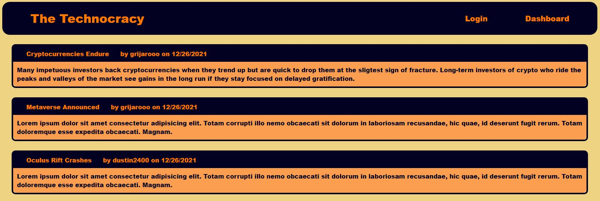

# The Technocracy

## Description
    This tech blog site allows users to create create blog posts and make comments on posts.

  ## Table of Contents
  *[Installation](#installation)

  *[Usage](#usage)

  *[Links](#links)

  ## Installation
    This application requires node.js, express.js, bcrypt, sequelize, handlebars, express-session, connect-session-sequelize, insomnia, and mysql to run locally, but can be used on the Heroku link.

  ## Usage
  All blog posts are accessible form the homepage. After creating a username or logging in, a user can create blog posts and comments for other's blog posts. The user's blog posts and comments can be edited or deleted from their dashboard.
  

  ## Links

  [GitHub](https://github.com/Dustin2400/the-technocracy)

  [Heroku](https://the-technocracy.herokuapp.com/)

##
  Made with ❤️ by Dustin Grijalva